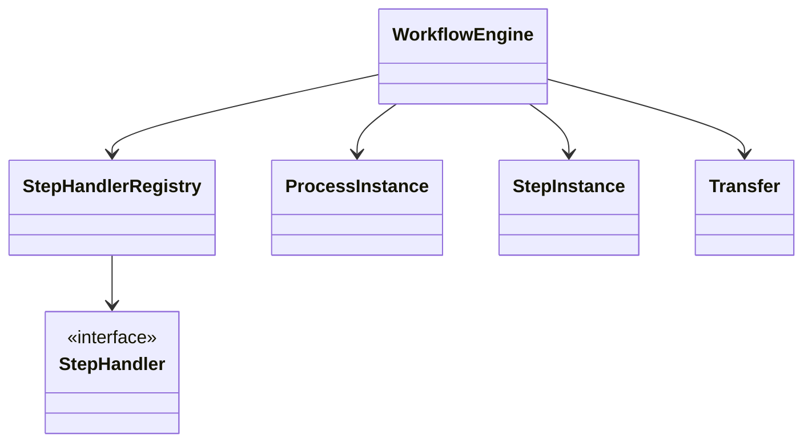
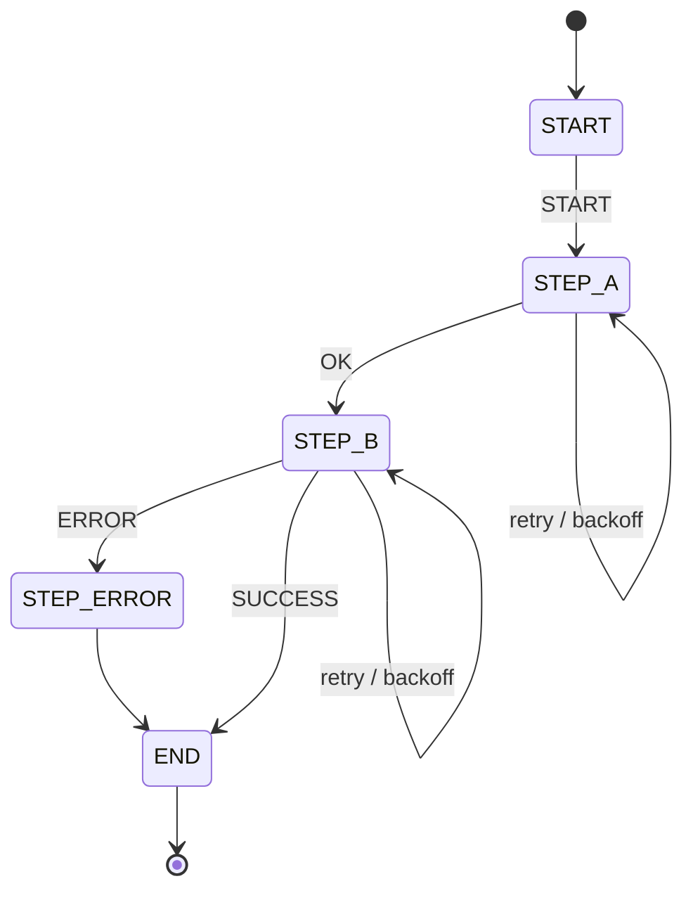
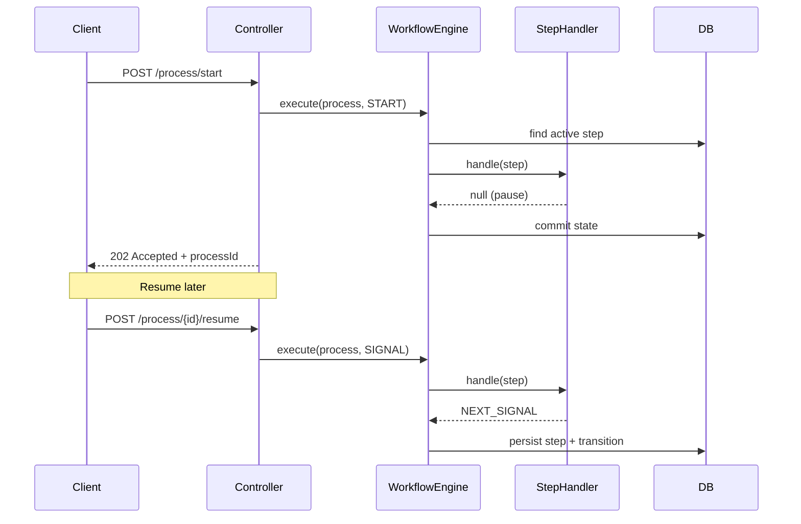
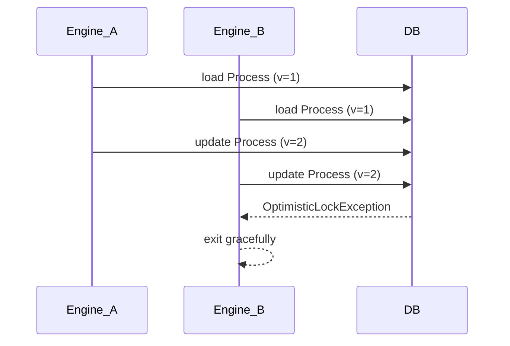
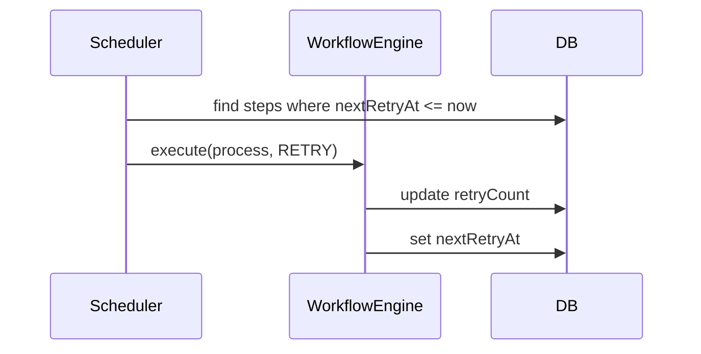

1️⃣ Общая архитектура Workflow Engine

WorkflowEngine — это orchestration-слой.
Он не знает деталей шагов, только управляет состоянием и переходами.
Логика шагов инкапсулирована в StepHandler’ах.

---

2️⃣ FSM / Execution Flow (ключевая диаграмма)

Это конечный автомат.
Переходы определяются сигналами, а retry — это просто возврат в тот же шаг с задержкой.

---

3️⃣ Sequence diagram — pause / resume (очень сильная)

Pause — это осознанное завершение транзакции без продолжения процесса.
Resume — повторный запуск engine с новым сигналом.

---

4️⃣ Optimistic Locking (конкурентный запуск)

Конкуренция разрешается optimistic locking’ом.
Один из потоков безопасно проигрывает — процесс остаётся консистентным.

---

5️⃣ Retry + Backoff (scheduler)

Retry управляется данными, а не кодом.
Engine просто исполняет то, что готово к выполнению.